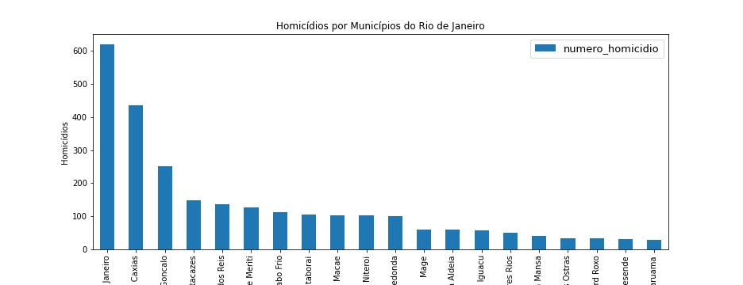
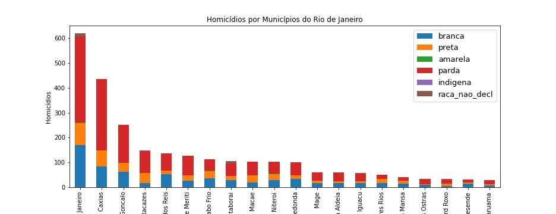
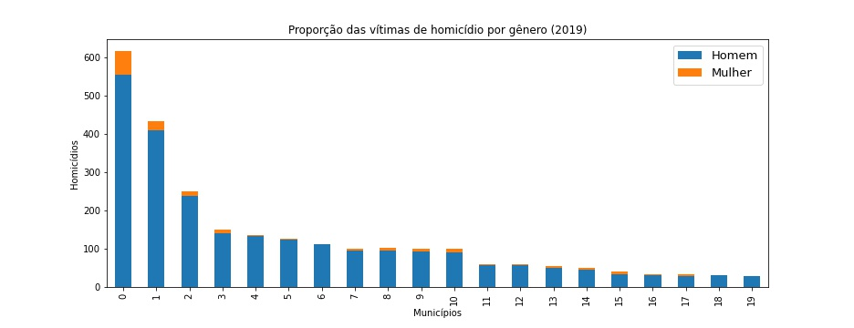
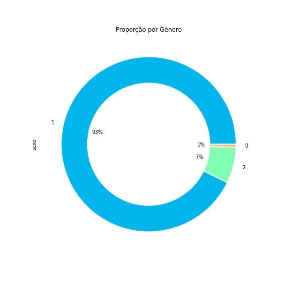
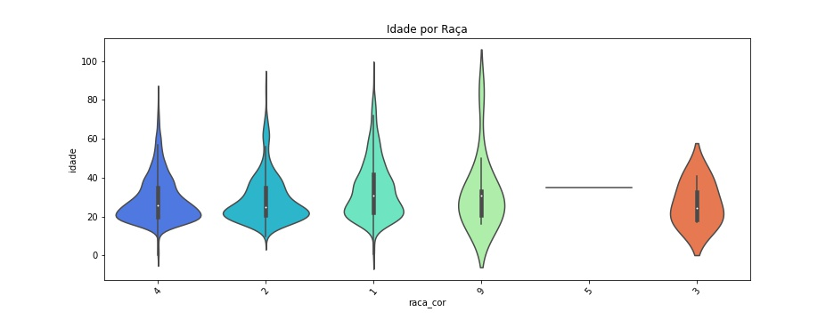
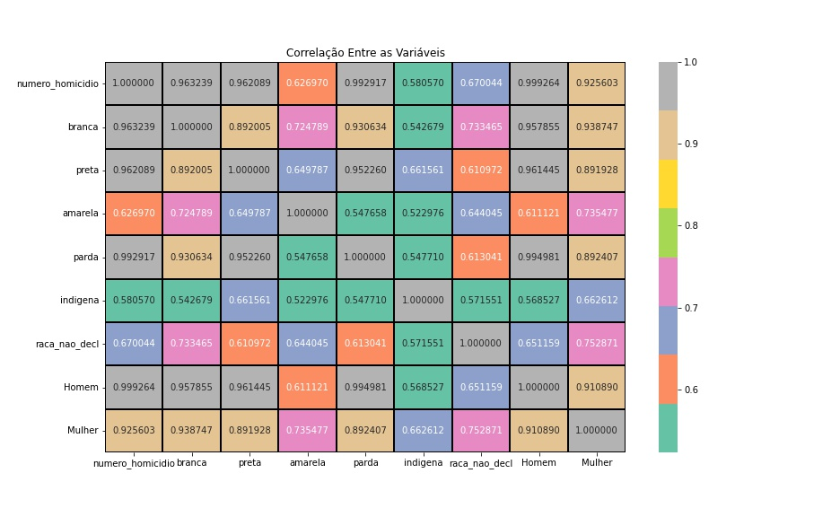

# Homicidio_RJ

# Objetivo

O presente projeto tem como objetivo analisar o perfil das vítimas de homicídio nas cidades com maior número de assassinatos (números absolutos) do Estado do Rio de Janeiro. Para tal, fiz uso dos dados do Sistema de Informações de Mortalidade (SIM). Os dados foram baixados direto do datalake do Base dos Dados (BD). Foi necessário fazer alguns tratamentos nos microdados do SIM para conseguir fazer a análise do perfil das vítimas. Foi dada ênfase a questões como gênero, raça, idade etc. Foram analisadas apenas as cidades com maior número (absolutos) de assassinatos, pois do Estado do Rio de Janeiro tem como característica a concentração de alguns dados na região metropolitana do estado. 

## Bibliotecas 

As bibliotecas abaixo foram utilizadas para tratar os microdados do SIM e gerar as visualizações do projeto:

* `pandas`(manipulação e visualização de dados);
* `basedosdados`(coleta de dados);
* `numpy`(manipulação de dados);
* `matplotlib.pyplot`(visualização de dados);
* `seaborn`(visualização de dados estatísticos);

## Visualização de Dados

A violência no Estado do Rio de Janeiro é bastante concentrada, o que implica em estatísticas bem baixas para muitos municípios.
Para lidar com este problema, focamos nas vinte cidades com os maios números absolutos de homicídios do estado fluminense. No gráfico abaixo, temos estes municípios.

Pretendo estabelecer o perfil mais frequente dos homicídios. Para responder tal pergunta, irei usar como características como gênero, raça e idade. No segundo gráfico, é possível ver que há uma discrepância entre raças. Pardos são a principal vítima deste tipo de violência. Entretanto, como o IBGE estabelece que negros são a junção de pardos e pretos, a vítima mais evidente passa a ser o negro fluminense. Em todas cidades, com exceção Araruama, os negros são as principais vítimas.

Agora, já sabemos a raça da vítima dos homicídios no Estado do Rio de Janeiro. Precisamos definir o gênero desta vítima. Pelo gráfico abaixo, é percpetível que os homens são vítimas mais frequentes do que mulheres em todas as vinte cidades. 

Ademais, podemos ver também os dados do estado inteiro. Esta perspectiva não se altera. Os homens continuam sendo os principais alvos dos homicídios. Cerca de 93% dos homicídios as vítimas eram homens. Esta desproporção nos indica que estamos no caminho correto.

Precisamos definir a idade da nossa vítima padrão. Em alguns gráficos, podemos ver que a maior parte das vítimas são jovens entre 20 e 40 anos. Se olharmos os negros (pardos e pretos), essa média de idade cai ainda mais.

Pelas visualizações que temos até agora, temos um indicativo que a vítima padrão dos homicídios do Estado do Rio de Janeiro é homem, negro e jovem. O quadro de correlação abaixo ajuda a consolidar este perfil. Antes, precisamos ressaltar que todos as variáveis têm uma correlação positiva com o número de homicídios. Entretanto, vamos focar naqueles cuja correlação é mais alta. Tanto a variável homem quanto a raça parda tem as correlações altas. O primeiro tem 0.9992 de coeficiente de correlação. Já o segundo tem 0.9929 de coeficiente de correlação. 

